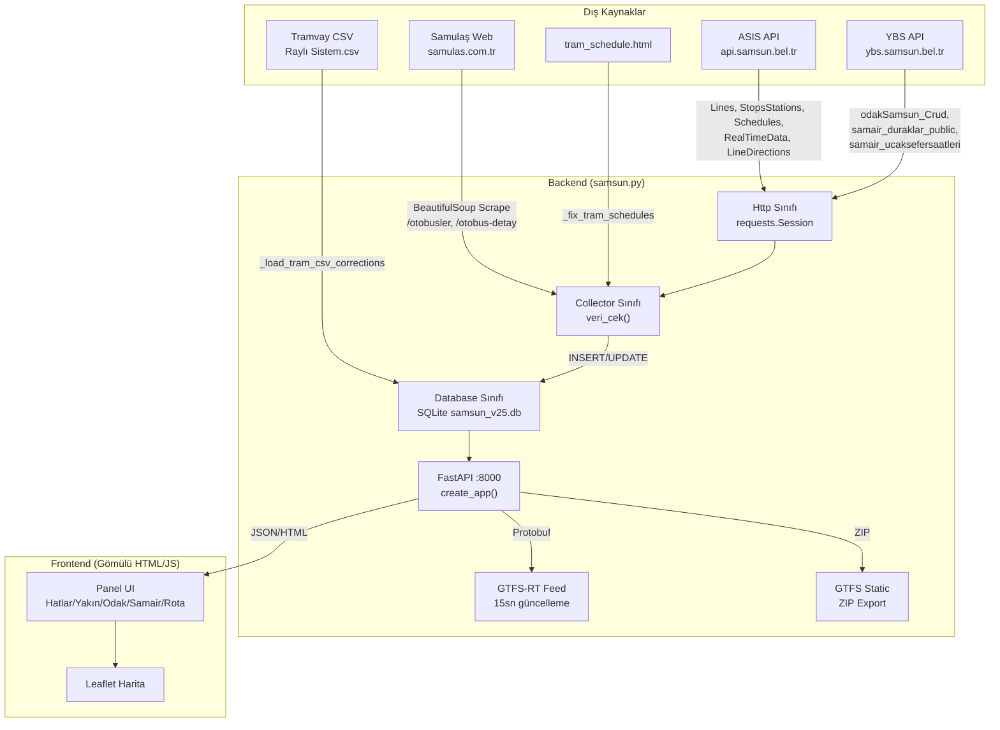
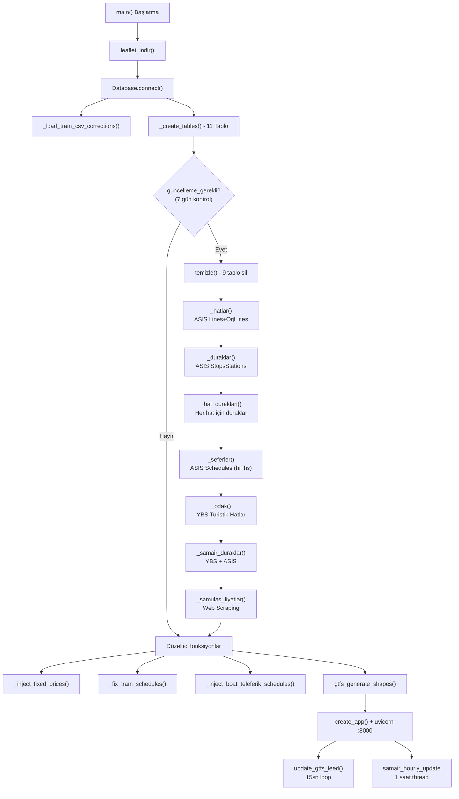

# 🚌 SAMSUN TRANSIT v25 - MASTER ŞEMA

> **samsun.py** (2720 satır) - Tüm API'ler, Veritabanı, Veri Akışı ve GTFS Feed birleşik şeması

---

## 📐 Sistem Mimarisi



---

## 🌐 DIŞ API KAYNAKLARI

### 1. ASIS API (Samsun Belediyesi)

| Endpoint | URL | Params | Response Format | Dönen Alanlar | Kullanıldığı Yer |
|----------|-----|--------|----------------|---------------|-------------------|
| **Lines** | `GET /api/Asis/Lines` | — | JSON `{data:[...]}` | `lineCode, lineNo, lineName, shortLineName, tip` | `_hatlar()` |
| **OrjLines** | `GET /api/Asis/OrjLines` | — | JSON `{data:[...]}` | `lineCode, lineNo, lineName, shortLineName` | `_hatlar()` |
| **StopsStations** | `GET /api/Asis/StopsStations` | `lineCode?`, `stopId?` (int) | JSON `{data:[...]}` | `stopId, stopName, orderId, latitude, longitude` | `_duraklar()`, `_hat_duraklari()`, `_samair_duraklar()` |
| **RealTimeData** | `GET /api/Asis/RealTimeData` | `lineCode` (str) | JSON `{data:[...]}` | `plaka, enlem, boylam, hiz, yon, seferYolcu, aci, kapasite` | `canli()`, `update_gtfs_feed()` |
| **Schedules** | `GET /api/Asis/Schedules` | `lineCode`, `scheduleDate` (datetime) | JSON `{data:[...]}` | `cizelgekodu, hatkodu, saat, yon` | `_seferler()` |
| **LineDirections** | `GET /api/Asis/LineDirections` | `lineCode` (str) | JSON `{data:[...]}` | `Direction, lineCode, lineNo, stopName, orderId, durakId` | `api_hat_yonler()` |
| **SmartStations** | `GET /api/Asis/SmartStations` | `stationId` (int) | JSON `{data:[...]}` | Akıllı durak verisi | (Şu an kullanılmıyor) |

**Base URL:** `https://api.samsun.bel.tr/OHSSoapToJson/api/Asis`
**Auth:** Yok (Public)
**Encoding Sorunu:** Windows-1254 → UTF-8 dönüşümü `fix_turkish()` ile yapılır
**Swagger:** `/api/Asis` altında JSON REST

---

### 2. YBS API (Samsun Belediyesi - Token Bazlı)

| Method | Submethod | Ek Params | Response | Dönen Alanlar | Kullanıldığı Yer |
|--------|-----------|-----------|----------|---------------|-------------------|
| **getGuestToken** | — | — | `{token:"..."}` | Token string | `ybs_token()` |
| **odakSamsun_Crud** | `HatlarAllList` | — | `{status, data:[...]}` | `id, hat_adi, hat_aciklama, gunler` | `_odak()` |
| **odakSamsun_Crud** | `GetHatDuraklar` | `hatid` | `{status, data:[...]}` | `durak_adi, durak_fiyat, durak_fiyat_ogrenci, durak_kodu, sira, lat, lon` | `_odak()` |
| **samair_duraklar_public** | `DuraklarList` | — | `{status, data:[...]}` | `durak_adi, durak_fiyat, durak_kodu, lat, lon` | `_samair_duraklar()` |
| **samair_ucaksefersaatleri_public** | `HatlarList` | `hatid` | `{status, data:[...]}` | `id, saat, varis_saati, ucak_firmasi, ucak_saatleri, tarih, formatted_date` | `samair_seferler_guncelle()` |

**Base URL:** `https://ybs.samsun.bel.tr/service/`
**Auth:** Token (200sn TTL, `getGuestToken` ile alınır)
**Format:** GET, Query string params, JSON response

---

### 3. Samulaş Web Scraping

| Sayfa URL | Yöntem | Çıkarılan Veri | Kullanım |
|-----------|--------|----------------|----------|
| `samulas.com.tr/otobusler?page=N` | BeautifulSoup | Otobüs detay linkleri (`a[href*=otobus-detay]`) | Fiyat listesi |
| `samulas.com.tr/otobus-detay/X` | BeautifulSoup | `.section-title h2` → Hat adı, `.col-6.p-2` → Fiyat | `_samulas_fiyatlar()` |

**Sayfa aralığı:** 1-8 (toplam ~74 hat)
**Fiyat eşleştirme:** `SAMULAS_FIYAT_ESLESTIRME` dict + `HAT_ALIAS` ile hat kodu bulunur

---

### 4. Statik Dosya Kaynakları

| Dosya | Format | İçerik | Kullanım |
|-------|--------|--------|----------|
| `*.csv` (Raylı Sistem) | CSV: `WKT, ad` | Tramvay durak koor. POINT format | `_load_tram_csv_corrections()` |
| `tram_schedule.html` | HTML Tablo | Tramvay sefer sıklıkları | `_fix_tram_schedules()` |

---

## 🗄️ VERİTABANI ŞEMASI (SQLite - samsun_v25.db)

### Ana Tablolar

```sql
-- Metadata (Güncelleme tarihleri)
meta(key TEXT PK, value TEXT)

-- Hat bilgileri (ASIS Lines + OrjLines)
hat(code TEXT PK, name TEXT, tip TEXT, kat TEXT, alias TEXT DEFAULT '')
-- tip: 'gidis' | 'donus'
-- kat: 'otobus' | 'ekspres' | 'ring' | 'tramvay' | 'teleferik' | 'tekne' | 'havalimani' | 'ilce'

-- Tüm duraklar (benzersiz)
durak(id TEXT PK, kod TEXT, ad TEXT, lat REAL, lon REAL)

-- Hat güzergah durakları (ASIS StopsStations lineCode ile)
hat_durak(id INTEGER PK, hat TEXT, durak_id TEXT, ad TEXT, sira INT, lat REAL, lon REAL)

-- Sefer saatleri (ASIS Schedules)
sefer(id INTEGER PK, hat TEXT, saat TEXT, yon TEXT, gun TEXT)
-- gun: 'hi' (hafta içi) | 'hs' (hafta sonu) | 'Her Gün' | 'Hafta Sonu'
```

### Fiyat Tablosu (Çoklu Kaynak)

```sql
fiyat(
    id INTEGER PK,
    kaynak TEXT,               -- 'samulas' | 'fixed' | 'samair' | 'odak'
    hat_adi TEXT,
    hat_code TEXT DEFAULT '',
    tam_fiyat REAL DEFAULT 0,
    indirimli_fiyat REAL DEFAULT 0,
    ogrenci_fiyat REAL DEFAULT 0,
    aktarma1 TEXT,             -- 'Ücretsiz' | '6.50 TL' | 'Yok'
    aktarma2 REAL DEFAULT 0,
    link TEXT,
    guncelleme TEXT            -- 'YYYY-MM-DD HH:MM'
)
```

### Odak Tabloları (Turistik Hatlar - YBS API)

```sql
odak(id TEXT PK, ad TEXT, kod TEXT, gunler TEXT)

odak_durak(id INTEGER PK, hat TEXT, ad TEXT, kod TEXT, sira INT,
           lat REAL, lon REAL, fiyat TEXT, fiyat_ogr TEXT)
```

### Samair Tabloları (Havalimanı Shuttle)

```sql
samair(id INTEGER PK, ad TEXT, kod TEXT)

samair_durak(id INTEGER PK, hat INTEGER, ad TEXT, kod TEXT,
             sira INT, lat REAL, lon REAL, fiyat TEXT)

samair_sefer(id INTEGER PK, hat INT, saat TEXT, varis TEXT,
             firma TEXT, ucak_saat TEXT, tarih TEXT, gun_format TEXT)
```

### GTFS ve Yön Tabloları

```sql
hat_yon(id INTEGER PK AUTOINCREMENT, hat TEXT NOT NULL,
        yon_id TEXT NOT NULL, yon_adi TEXT, UNIQUE(hat, yon_id))

gtfs_shape(shape_id TEXT NOT NULL, shape_pt_lat REAL NOT NULL,
           shape_pt_lon REAL NOT NULL, shape_pt_sequence INT NOT NULL,
           shape_dist_traveled REAL, PRIMARY KEY(shape_id, shape_pt_sequence))
```

### İndeksler

```sql
idx_hd ON hat_durak(hat)
idx_sf ON sefer(hat)
idx_sd ON samair_durak(hat)
idx_dk_latlon ON durak(lat, lon)
idx_fiyat_kaynak ON fiyat(kaynak)
idx_hat_yon ON hat_yon(hat)
idx_shape ON gtfs_shape(shape_id)
```

---

## 🔌 LOCAL API ENDPOİNTLERİ (FastAPI :8000)

### Ana Sayfa

| Yol | Method | Response | Format | Açıklama |
|-----|--------|----------|--------|----------|
| `/` | GET | Gömülü HTML | `HTMLResponse` | Harita + Panel UI (Leaflet) |

### Hat API'leri

| Yol | Method | Params | Response Format | İçerik | SQL Kaynağı |
|-----|--------|--------|-----------------|--------|-------------|
| `/api/hat` | GET | — | JSON Array | `[{code, name, tip, kat, alias}]` | `SELECT * FROM hat` |
| `/api/hat/info/{code}` | GET | `code` (path) | JSON Object | `{code, name, tip, kat, alias}` | `SELECT * FROM hat WHERE code=?` |
| `/api/hat/durak/{code}` | GET | `code` (path) | JSON Array | `[{hat, durak_id, ad, sira, lat, lon}]` | `SELECT * FROM hat_durak WHERE hat=?` |
| `/api/hat/sefer/{code}` | GET | `code` (path) | JSON Array | `[{hat, saat, yon, gun}]` | `SELECT * FROM sefer WHERE hat=?` |
| `/api/hat/fiyat/{code}` | GET | `code` (path) | JSON Object | `{tam_fiyat, indirimli_fiyat, aktarma1, ...}` | fiyat tablosundan 4 aşamalı arama |
| `/api/hat/arac/{code}` | GET | `code` (path) | JSON Array | `[{plaka, lat, lon, hiz, yon, yolcu, yakin}]` | ASIS RealTimeData (canlı) |
| `/api/hat/esles/{code}` | GET | `code` (path) | JSON Object | `{code: "karşı yön kodu"}` | `esles()` fonksiyonu |
| `/api/hat/{code}/yonler` | GET | `code` (path) | JSON Array | `[{yon_id, yon_adi}]` | hat_yon tablosu + ASIS fallback |

**Not:** `{code:path}` format → URL-encoded hat kodları (`%20` boşluk) desteklenir.

### Konum Bazlı API'ler

| Yol | Method | Params | Response Format | İçerik |
|-----|--------|--------|-----------------|--------|
| `/api/yakin` | GET | `lat` (float), `lon` (float) | JSON Array | `[{kod, ad, lat, lon, dist}]` (500m yarıçap) |
| `/api/durak_panel/{kod}` | GET | `kod` (path str) | JSON Array | `[{hat, ad, kat, gelen:{plaka, tahmini_dk, durak_kaldi, hiz, doluluk, lat, lon, verify}}]` |
| `/api/rota` | GET | `lat1, lon1, lat2, lon2` (float) | JSON Array | `[{desc: HTML}]` (Akıllı rota kartları) |

### Odak (Turistik) API'leri

| Yol | Method | Response Format | İçerik |
|-----|--------|-----------------|--------|
| `/api/odak` | GET | JSON Array | `[{id, ad, kod, gunler}]` |
| `/api/odak/{id}/durak` | GET | JSON Array | `[{hat, ad, kod, sira, lat, lon, fiyat, fiyat_ogr}]` |

### Samair (Havalimanı) API'leri

| Yol | Method | Response Format | İçerik |
|-----|--------|-----------------|--------|
| `/api/samair` | GET | JSON Array | `[{id, ad, kod}]` |
| `/api/samair/{id}/durak` | GET | JSON Array | `[{hat, ad, kod, sira, lat, lon, fiyat}]` |
| `/api/samair/{id}/sefer` | GET | JSON Object | `{data: [{hat, saat, varis, firma, ucak_saat, tarih}], last_update}` |

### GTFS Feed Endpoint'leri

| Yol | Method | Format | İçerik |
|-----|--------|--------|--------|
| `/gtfs-rt/vehicle-positions` | GET | `application/x-protobuf` | GTFS-RT VehiclePositions binary |
| `/gtfs-rt/vehicle-positions.json` | GET | JSON | GTFS-RT debug (protobuf→JSON) |
| `/gtfs/static.zip` | GET | `application/zip` | GTFS Static feed ZIP |
| `/gtfs/validate` | GET | JSON | Validator URL'leri ve durum bilgisi |

### Debug

| Yol | Method | Response | İçerik |
|-----|--------|----------|--------|
| `/api/debug/endpoints` | GET | JSON | ASIS endpoint listesi, kullanım durumu |

---

## 🏗️ KOD YAPISI (Sınıflar ve Fonksiyonlar)

### Yardımcı Fonksiyonlar (Global)

| Fonksiyon | Satır | Girdi | Çıktı | Açıklama |
|-----------|-------|-------|-------|----------|
| `parse_int(val)` | 128 | any | int\|None | Güvenli int dönüşümü |
| `parse_float(val)` | 137 | any | float | Güvenli float (`','`→`'.'`) |
| `clean_price(text)` | 142 | `"17,00 TL"` | `17.0` | Fiyat parse |
| `fix_turkish(text)` | 153 | bozuk str | düzgün str | Windows-1254→UTF-8 karakter düzeltme |
| `haversine(lat1,lon1,lat2,lon2)` | 178 | koordinatlar | metre | İki nokta arası mesafe |
| `calculate_eta(dist_m, speed_kmh)` | 187 | mesafe,hız | dakika | Tahmini varış süresi (×1.4 kıvrım payı) |
| `leaflet_indir()` | 194 | — | bool | Leaflet CSS/JS/ikon dosyaları indir |

### Http Sınıfı (Satır 241-335)

```
Http
├── __init__()         → requests.Session + retry (3×, 0.3s backoff)
├── asis(ep, **p)      → ASIS API GET çağrısı, JSON parse, hata yönetimi
├── ybs_token()        → Token al (200sn cache)
└── ybs(method, sub)   → YBS API GET çağrısı (token otomatik)
```

### Database Sınıfı (Satır 339-483)

```
Database
├── __init__()                    → conn=None, _lk=Lock, durak_coords={}
├── connect()                     → SQLite bağlantı + tablo oluştur
├── _load_tram_csv_corrections()  → CSV'den tramvay koordinat düzeltmeleri
├── _create_tables()              → 11 tablo + 7 indeks oluştur
├── _load_durak_coords()          → Belleğe durak koordinatları yükle
├── get_meta(key) / set_meta()    → meta tablosu CRUD
├── guncelleme_gerekli()          → 7 gün geçti mi? (hat tablosu kontrolü)
├── samair_guncelleme_gerekli()   → 1 saat geçti mi?
├── temizle()                     → 9 tabloyu temizle
├── ex(q, p) / exm(q, d)         → Execute / ExecuteMany (thread-safe)
├── get(q, p) / one(q, p)        → FetchAll / FetchOne (dict döner)
└── cnt(t)                        → Tablo satır sayısı
```

### Collector Sınıfı (Satır 487-1711)

```
Collector
├── veri_cek()                        → Ana güncelleme orchestrator (7 günde 1)
│
├── # VERİ ÇEKME
├── _hatlar()                         → Lines + OrjLines → hat tablosu
├── _duraklar()                       → StopsStations (tümü) → durak tablosu
├── _hat_duraklari()                  → StopsStations (hat bazlı) → hat_durak
├── _seferler()                       → Schedules (hi+hs) → sefer tablosu
├── _odak()                           → YBS HatlarAllList + GetHatDuraklar
├── _samair_duraklar()                → YBS + ASIS fallback → samair_durak
├── _samulas_fiyatlar()               → Web scraping → fiyat tablosu
│
├── # DÜZELTİCİLER
├── _inject_fixed_prices()            → Hardcoded fiyatlar (tramvay, teleferik vb.)
├── _fix_tram_schedules()             → HTML'den tramvay seferleri
├── _fix_stop_coordinates()           → (DEVRE DIŞI - CSV kullanılıyor)
├── _inject_boat_teleferik_schedules()→ Tekne/Feribot sabit seferleri
│
├── # CANLI VERİ
├── canli(code)                       → ASIS RealTimeData → araç listesi
├── samair_seferler_guncelle(force)   → YBS uçuş seferleri güncelle
│
├── # KONUM HİZMETLERİ  
├── yakindaki_duraklar(lat, lon)      → 500m yarıçap durak arama
├── yakin_durak(arac, duraklar)       → En yakın durak adı
├── durak_bilgi(durak_kodu)           → Duraktan geçen hatlar + canlı araç
│
├── # ROTA
├── akilli_rota(lat1,lon1,lat2,lon2)  → Puanlama bazlı rota (direkt+aktarmalı)
├── yol_tarifi(lat1,lon1,lat2,lon2)   → akilli_rota wrapper
├── esles(code)                       → Gidiş↔Dönüş eşleştirme
│
├── # GTFS
├── calculate_realistic_stop_times()  → Mesafe bazlı gerçekçi varış süreleri
├── create_shape_from_stops()         → Durak→Shape çizgi oluşturma
├── save_shapes_to_db()               → Shape noktalarını DB'ye kaydet
└── gtfs_generate_shapes()            → Tüm hatlar için shape üret
```

### create_app() (Satır 2239-2669) - FastAPI Setup

```
create_app(db, col)
├── CORSMiddleware (allow_origins=["*"])
├── startup_event → asyncio.create_task(update_gtfs_feed)
├── update_gtfs_feed() → 15sn loop, protobuf güncelle
└── 24 endpoint tanımı (yukarıdaki tablo)
```

### main() (Satır 2671-2720)

```
main()
├── leaflet_indir()
├── Database().connect()
├── Collector(db, Http())
├── col.veri_cek()
├── col.samair_seferler_guncelle()
├── create_app(db, col)
├── samair_hourly_update thread (1 saat periyot)
└── uvicorn.run(:8000)
```

---

## 🔄 VERİ AKIŞ DİYAGRAMI



---

## 📊 SABİT EŞLEŞTİRME TABLOLARI

### HAT_ALIAS (OrjLines → Kısa Kod) - 20 kayıt

| OrjLines İsim | Kısa Kod |
|---------------|----------|
| `SAMULAŞ EKSPRES 1-GİDİŞ/DÖNÜŞ` | E1 |
| `SAMULAŞ EKSPRES 2-GİDİŞ/DÖNÜŞ` | E2 |
| `SAMULAŞ EKSPRES 3-7-GİDİŞ/DÖNÜŞ` | E3-E7 |
| `15/A BÜYÜK CAMİ-SOĞUKSU` | 15 |
| `20 BEL.ELERİ-B.KOLPINAR` | 20 |
| `22 SOĞUKSU-TÜRKİŞ` | 22 |
| `25 OTOGAR-200 EVLER` | 25 |
| `R2 CEZAEVİ-BÜYÜK CAMİ` / `28` | R2 |

### SAMAIR_HATLAR (ID → YBS hatid) - 4 kayıt

| ID | Hat | ASIS İsimleri | YBS hatid |
|----|-----|---------------|-----------|
| 1 | H1 OMÜ-HAVALİMANI | H1 OMÜ-HAVALİMANI, H1 HAVALİMANI-OMÜ | [3] |
| 2 | H2 TTTM-HAVALİMANI | H2 TTTM-HAVALİMANI, H2 HAVALİMANI-TTTM | [4] |
| 3 | H3 BAFRA-HAVALİMANI | H3 BAFRA-HAVALİMANI, H3 HAVALİMANI-BAFRA | [5] |
| 4 | H4 ÇARŞAMBA-HAVALİMANI | H4 ÇARŞAMBA-HAVALİMANI, H4 HAVALİMANI-ÇARŞAMBA | [9] |

### Hat Kategorileri (kat fonksiyonu) - Öncelik sırasına göre

| Kategori | Koşul | Renk (UI) |
|----------|-------|-----------|
| `ring` | `R` ile başlayan + rakam | `#f39c12` |
| `tramvay` | İsimde "TRAMVAY" | `#e67e22` |
| `teleferik` | İsimde "TELEFERİK" | `#e91e63` |
| `tekne` | İsimde "GEMİ/VAPUR/FERİBOT/TEKNE" | `#3498db` |
| `havalimani` | `H` + rakam | `#e74c3c` |
| `ekspres` | "EKSPRES" veya `E` + rakam | `#9b59b6` |
| `ilce` | İsimde ilçe adı (TERME, BAFRA vb.) | `#1abc9c` |
| `otobus` | Yukarıdakilere uymayan | `#1877f2` |

### Sabit Fiyatlar (Hardcoded)

| Hat Tipi | Tam Fiyat | İndirimli | Aktarma |
|----------|-----------|-----------|---------|
| Normal Otobüs | 17.00 TL | 12.00 TL | 6.50 TL |
| Ekspres | 23.50 TL | 15.00 TL | Ücretsiz |
| Ring | 17.00 TL | 12.00 TL | 6.50 TL |
| Tramvay | 26.50 TL | 16.50 TL | Ücretsiz |
| Teleferik | 25.00 TL | 15.00 TL | Yok |
| Samsunum Gemisi | 200.00 TL | 150.00 TL | Yok |
| Altınkaya Feribot | 15.00 TL | 7.00 TL | Yok |

---

## 📡 GTFS FEED DETAYLARI

### GTFS-RT (Gerçek Zamanlı)

| Özellik | Değer |
|---------|-------|
| Güncelleme | 15 saniye |
| Format | Protocol Buffers (protobuf) |
| Endpoint | `/gtfs-rt/vehicle-positions` |
| Debug | `/gtfs-rt/vehicle-positions.json` |
| İçerik | VehiclePositions (konum, hız, bearing, doluluk) |
| Kaynak | ASIS RealTimeData (ilk 50 hat) |
| Plaka Filtresi | Tekrarlı plakalar atlanır |
| Koordinat Filtresi | 40<lat<43 ve 34<lon<38 (Samsun bölgesi) |
| Doluluk Mapping | <20%=MANY_SEATS, <50%=FEW_SEATS, <80%=STANDING, ≥80%=FULL |

### GTFS Static (ZIP Export)

| Dosya | İçerik | Kaynak |
|-------|--------|--------|
| `agency.txt` | Samulaş bilgileri | Hardcoded |
| `routes.txt` | Hat listesi + renk kodları | `hat` tablosu |
| `stops.txt` | Durak koordinatları | `hat_durak` tablosu |
| `trips.txt` | trip_id + headsign + shape_id | `hat` tablosu |
| `stop_times.txt` | Gerçekçi varış süreleri | `calculate_realistic_stop_times()` |
| `calendar.txt` | Her gün çalışır (365 gün) | Otomatik |
| `shapes.txt` | Güzergah çizgileri | `gtfs_shape` tablosu |

---

## 🖥️ FRONTEND (Gömülü HTML/JS - Satır 1714-2237)

### UI Sekmeleri

| Sekme | Emoji | Fonksiyon | API Çağrıları |
|-------|-------|-----------|---------------|
| Hatlar | 🚌 | `loadHats()` → `shH()` | `/api/hat` |
| Yakın | 📍 | `shYakin()` | `/api/yakin?lat=&lon=` |
| Odak | 🎯 | `shO()` | `/api/odak`, `/api/odak/{id}/durak` |
| Samair | ✈️ | `shS()` | `/api/samair`, `/api/samair/{id}/durak`, `/api/samair/{id}/sefer` |
| Git | 📍 | `shRotaUI()` → `calcRota()` | `/api/rota?lat1=&lon1=&lat2=&lon2=` |

### Hat Detay Ekranı (`shL()`)

6 paralel API çağrısı yapar:
1. `/api/hat/info/{code}` → Hat bilgisi
2. `/api/hat/durak/{code}` → Duraklar
3. `/api/hat/sefer/{code}` → Seferler
4. `/api/hat/arac/{code}` → Canlı araçlar
5. `/api/hat/esles/{code}` → Karşı yön
6. `/api/hat/fiyat/{code}` → Fiyat

### Özel Bilgi Kutuları (HTML İnjeksiyon)

| Hat | İçerik |
|-----|--------|
| SAMSUNUM-1 | Hava durumu uyarısı, 200 TL fiyat, iletişim |
| SAMSUNUM-2 | "ÇALIŞMAMAKTADIR" (DSİ çalışması) |
| SAMSUNUM-3 | "Doldukça Kalkar", 200 TL |
| ALTINKAYA | Feribot araç/yolcu tarifesi |
| TELEFERİK | Çalışma saatleri (10:30-22:00), tarihçe |
| TRAMVAY | Tab'lı sefer sıklığı tabloları (Hİ/Cmt/Pzr) |

### Canlı Araç Güncelleme

- `upV()` fonksiyonu 5 saniyede bir çağrılır (`setInterval`)
- Araç ikonları Leaflet `divIcon` ile haritaya eklenir
- En yakın durak bilgisi ile durak kartına `vtg` badge eklenir

---

## ⚙️ BAĞIMLILIKLAR

| Paket | Kullanım |
|-------|----------|
| `fastapi` | Web framework |
| `uvicorn` | ASGI server |
| `requests` | HTTP istemci (ASIS, YBS, Samulaş) |
| `httpx` | Async HTTP (import var ama aktif kullanımda değil) |
| `beautifulsoup4` | Samulaş web scraping |
| `google.transit.gtfs_realtime_pb2` | GTFS-RT protobuf |
| `pydantic` | FastAPI veri modelleri |
| `sqlite3` | Veritabanı (stdlib) |
| `urllib3` | SSL uyarı kapatma |

---

## 🔧 GÜNCEL SAYILAR

| Metrik | Değer |
|--------|-------|
| Toplam Hat | ~107 |
| Fiyat Eşleşme | 74/74 (%100) |
| Odak Koordinatlı | 67/72 (%93) |
| Samair Durak | ~209 |
| ASIS Durak | ~4538 |
| DB Tabloları | 11 |
| API Endpoint | 24 |
| Güncelleme Periyodu | 7 gün (ana) / 1 saat (samair) / 15sn (GTFS-RT) |
